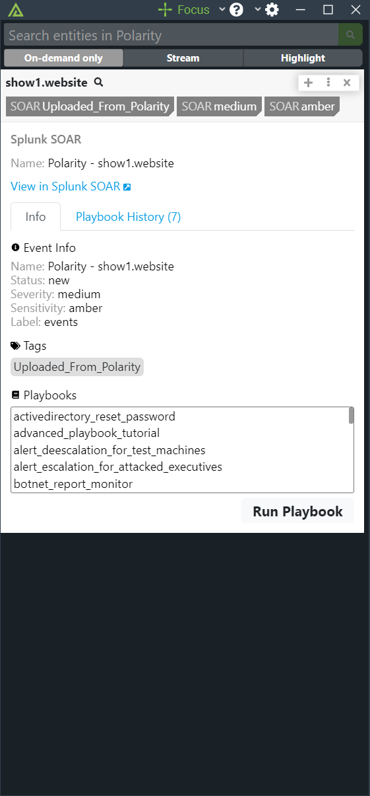
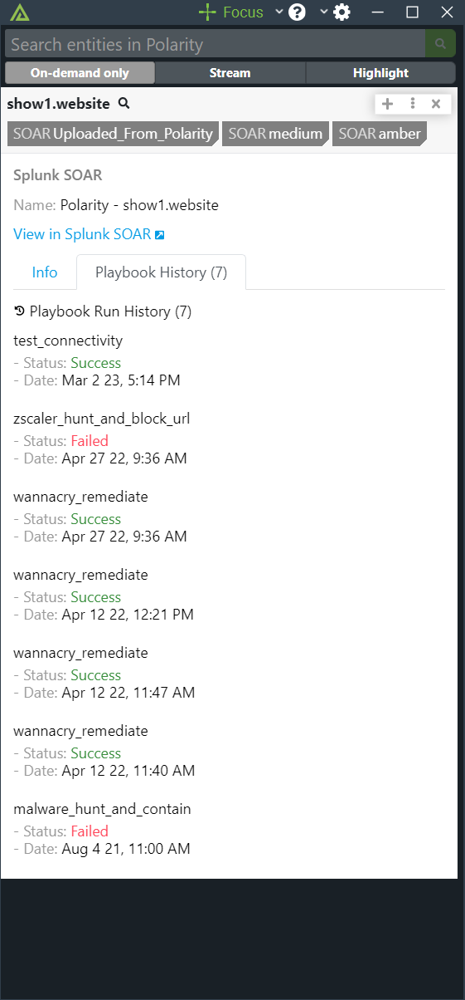
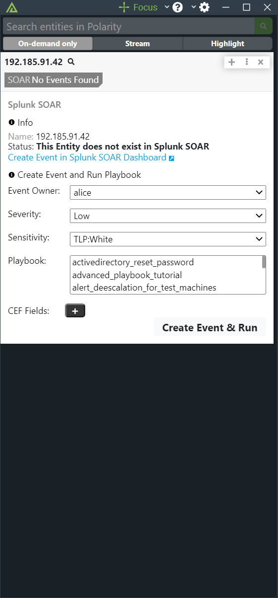
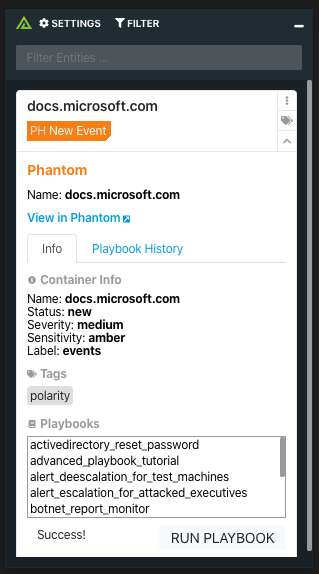

# Polarity Phantom Integration

Polarity's Phantom integration allows automated queries against Phantom's container and artifact database, create containers from entities, and allows a user to execute pre-defined playbooks from the Polarity overlay window.

## Normal Event with Playbook History

  
  

## Create New Event

  
  

To learn more about Phantom, visit the [official website](https://www.phantom.us).

> *NOTE*: Your automation user must have the "Administrator" role for full search results to show up when searching

## Phantom Integration Options

### Server URL

The Server URL where the Phantom API instance is located.  The Server URL should include the schema (https://), and the fully qualified domain name or IP address of the Phantom server. For example, `https://myphantom.server`.

### Token

The API token used to authenticate with the Phantom server.  See the official Phantom documentation for instructions on setting up an API token.

### Playbook Labels

A comma separated list of Playbook Labels used to determine which playbooks can be run on Indicators in Phantom. By adding labels, you make more Playbooks available for you to run. The default value is "events".

### Playbook Repository Names

A comma separated list of Playbook Repository Names for Playbook Repositories you want to use. If left blank, all Playbooks from all Playbook Repositories with be available for use. (Must restart the integration for changes to take effect)

### Default Submission Label

This is the Default Label that is used on all Events and Artifacts that are submitted to Phantom. If left blank, the Event and Artifact Label will be the same as the Playbook's Label that was selected on Event creation.

### Max Container Results

Limits the amount of Containers that will show up when searching.

### Display Dashboard Creation Link

If unchecked, the link that says "Create Event in Phantom Dashboard" will not be displayed on overlay results for New Entity Submission.

### Compare Playbook and Event Labels

If checked, only Playbooks that have the one of the labels on an Event will show up as possible Playbooks for you to run on that Event.

### Only Show Events with Playbook Labels

If checked, only Events that have one of your Playbook Labels listed will show up in the overlay.

## Installation Instructions

Installation instructions for integrations are provided on the [PolarityIO GitHub Page](https://polarityio.github.io/).

## Polarity

Polarity is a memory-augmentation platform that improves and accelerates analyst decision making.  For more information about the Polarity platform please see:

https://polarity.io/
