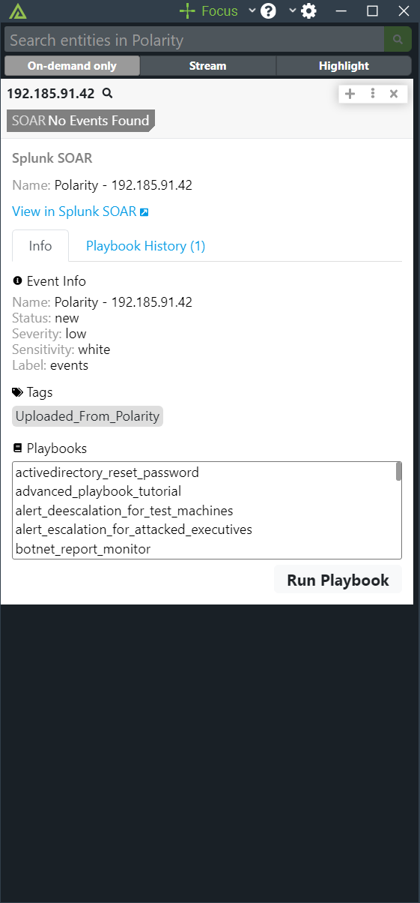

# Polarity Splunk SOAR Integration

Polarity's Splunk SOAR integration allows automated queries against Splunk SOAR's container and artifact database, creating containers from entities, and executing pre-defined playbooks from the Polarity Overlay Window.

## Normal Event with Playbook History

  
  

## Create New Event

  
  

To learn more about Splunk SOAR, visit the [official website](https://www.splunk.com/en_us/products/splunk-security-orchestration-and-automation.html).

> *NOTE*: Your automation user must have the "Administrator" role for full search results to show up when searching

## Splunk SOAR Integration Options

### Splunk SOAR Server URL

The Server URL where the Splunk SOAR API instance is located.  The Server URL should include the schema (https://) and the fully qualified domain name or IP address of your Splunk SOAR instance.

### Splunk SOAR API Token

The API token used to authenticate with the Splunk SOAR server.  See the [official documentation](https://docs.splunk.com/Documentation/SOAR/current/PlatformAPI/Using) for instructions on setting up an API token.

### Playbook Labels

A comma separated list of Playbook Labels used to determine which playbooks can be run on Indicators in Splunk SOAR. By adding labels, you make more Playbooks available for you to run. The default value is "events".

### Playbook Repository Names

A comma separated list of Playbook Repository Names for Playbook Repositories you want to use. If left blank, all Playbooks from all Playbook Repositories with be available for use. (Must restart the integration for changes to take effect)

### Default Submission Label

This is the Default Label that is used on all Events and Artifacts that are submitted to Splunk SOAR. If left blank, the Event and Artifact Label will be the same as the Playbook's Label that was selected on Event creation.

### Max Container Results

Limits the amount of Containers that will show up when searching.

### Only Show Events with Playbook Labels

If checked, only Events that have one of your Playbook Labels listed will show up in the overlay.

### Compare Playbook and Event Labels

If checked, only Playbooks that have the one of the labels on an Event will show up as possible Playbooks for you to run on that Event.

### Display Dashboard Creation Link

If checked, a "Create Event in Splunk SOAR Dashboard" link will be displayed for New Entity Submissions.

## Installation Instructions

Installation instructions for integrations are provided on the [PolarityIO GitHub Page](https://polarityio.github.io/).

## Polarity

Polarity is a memory-augmentation platform that improves and accelerates analyst decision making.  For more information about the Polarity platform please see:

https://polarity.io/
